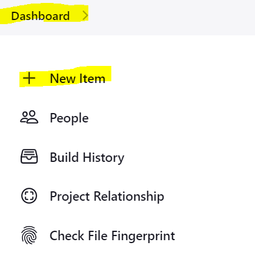
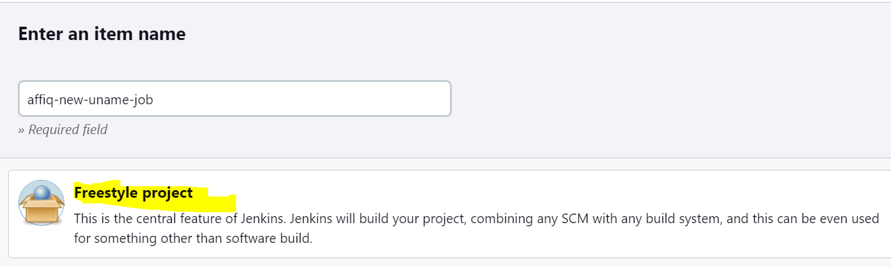
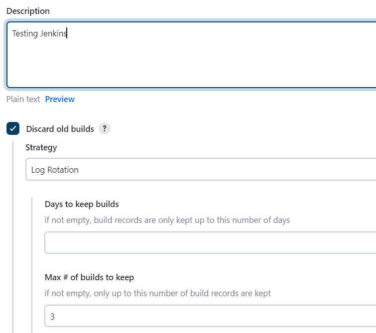
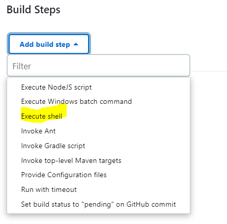
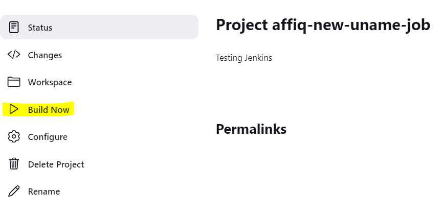
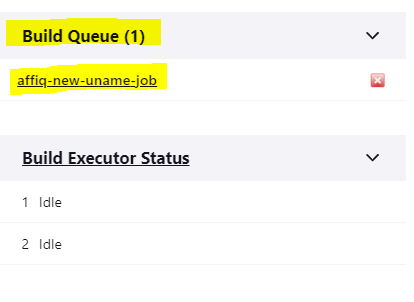
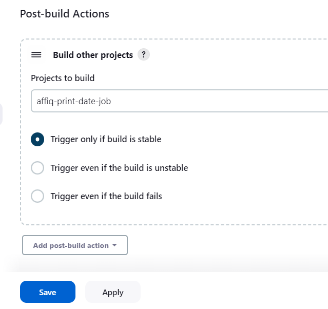

# Creating a Jenkins Job

We will first need to log into Jenkins where we should be introduced to a dashboard.

We will then need to create a new project by navigating to Create Item or Create Project.



We will then need to simply give it a name, and select ```Freestyle Project```. Select suitable names for your jobs that you can filter for as these will need to be searched when we chain jobs.

We will also need to give an optional description, as well as deleting old builds, and specifying that the maximum number of builds is 3.

We will also need to go to ```Build Steps > Add Build Steps > Linux Shell```, which functions a bit like user data for a VM. This will be the default code that will be executed during build. In our case, we will simply put the command to print the OS details.

```
uname -a
```







Once created, we will return to the page of the project, where we can click the Build Now option to run our build. We can also observe that our project has been added to the build queue. Alternatively, we can view the build status by the icon next to our project (100% success will show the sun, but the icon will be based on the average of the last 5 builds.)





We will then create a new project with the exact same configuration, except we will print the date. We will change the linux shell command to:
```
date
```

Once done, we can then build the project again to verify that it is working. Once doing so, we can run this build after the uname build by going to our first project, heading to configurations and then going to the ```Post Build Actions > Build Other Projects``` and search for the project that prints the date specific to you. You may have to delete a comma in this instance. After doing so, we can then run the first project and this should also trigger the build of the next project


