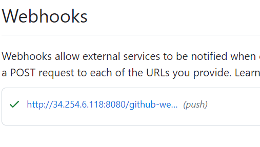

# Creating a Jenkins Job

We will first need to log into Jenkins where we should be introduced to a dashboard.

We will then need to create a new project by navigating to Create Item or Create Project.


We will then need to simply give it a name, and select ```Freestyle Project```. Select suitable names for your jobs that you can filter for as these will need to be searched when we chain jobs.

We will also need to give an optional description, as well as deleting old builds, and specifying that the maximum number of builds is 3.

We will also need to go to ```Build Steps > Add Build Steps > Linux Shell```, which functions a bit like user data for a VM. This will be the default code that will be executed during build. In our case, we will simply put the command to print the OS details.

```
uname -a
```


Once created, we will return to the page of the project, where we can click the Build Now option to run our build. We can also observe that our project has been added to the build queue. Alternatively, we can view the build status by the icon next to our project (100% success will show the sun, but the icon will be based on the average of the last 5 builds.)


We will then create a new project with the exact same configuration, except we will print the date. We will change the linux shell command to:
```
date
```

Once done, we can then build the project again to verify that it is working. Once doing so, we can run this build after the uname build by going to our first project, heading to configurations and then going to the ```Post Build Actions > Build Other Projects``` and search for the project that prints the date specific to you. You may have to delete a comma in this instance. After doing so, we can then run the first project and this should also trigger the build of the next project


# Creating a Jenkins Pipeline
We will now create a pipeline for our JSonVorhees application which consists of three phases:
* A test for a push into the main branch
* A push for a successful test
* A deployment

#### Configure GitHub Project

We will first need to follow the normal procedure to create a new project. However in the second configuration page, there will be some additional steps. Under GitHub projects, we will need to check Git Project and paste the project URL, which will be the HTTPS link instead of the SSH link.

#### Configure GitHub Repository

We will then need to navigate to the ```Source Code Management``` option and select Git. Under repositories we will then add the SSH link to our repository, in which it should throw an error.


This is as expected, as we will need to add our private key to Jenkins. As a prerequisite, GitHub should be initialised to accept this private key in the ```Manage SSH and GPG keys section```, so ensure that GitHub has your private key.

We will add our private key by clicking ```Add > Jenkins``` in which a new window should pop up. We will then need to change the ```Kind``` to ```SSH Username with Private Key```.
The username and ID should match the name of the private key file, and we will need to click the enter directly option and paste our SSH key in. (we can use ```cat <private-key>```) to get the content outputs. We will also need to copy the START OF SSH KEY and END OF SSH key output including the hyphens.

Once we reselect our credentials, the error message should no longer exist.


We will finally need to configure our maven build step by going to ```Build Step > Invoke top-Level Maven targets```, selecting a Maven version (we will use 3.6.3 but can be chosen using plugins) and then specifying the Maven command to execute. (```mvn package test``` will translate to the input field ```package test```). We will also need to specify our pom.xml relative to our project and so in this instance, as it is in springapi, we will configure it as ```springapi/pom.xml```.


We may also need to change the branch specifier to ```main```.


Once done, we can then save and build this project for our worker nodes to run. We can then observe build successes or failures through the console output of our project.oar

## Creating a pipeline with multiple jobs

#### Job 1: Testing pushes from Git

We will need to configure the webhook from GitHub's side to trigger Jenkins on repository push. We can then confirm a successful link to our webhook by the tick icon.




#### Job 2: Performing a Git Merge

We will now need the following configurations in our Jenkins.
We will use the Git Publisher post build action to trigger a merge into a remote repository. The Merge before build action is misleading as this makes a merge into our local repo.


