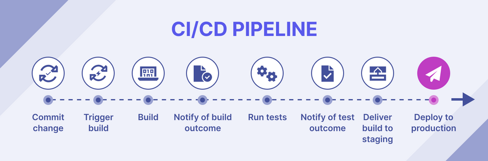

# CI/CD and Jenkins Overview

## Continuous Integration (CI):

Continuous Integration is a software development practice that involves frequently integrating code changes from multiple contributors into a shared repository. The main goal is to detect and address integration issues early in the development process, ensuring that the codebase is always in a functional state.

## Continuous Delivery / Continuous Deployment (CD):

- **Continuous Delivery (CD):**
  - Focuses on automating the delivery process to make releases more reliable and efficient. In Continuous Delivery, the software is always in a deployable state, but deployment to production is a manual decision.

- **Continuous Deployment (CDE):**
  - Takes the automation further by automatically deploying every code change that passes the automated tests to the production environment without manual intervention.

## Difference between CD and CDE:

Continuous Delivery (CD) and Continuous Deployment (CDE) are often used interchangeably, but the key distinction lies in the deployment to production:

- **Continuous Delivery (CD):**
  - The software is always ready for deployment, but the decision to deploy is manual.

- **Continuous Deployment (CDE):**
  - The software is automatically deployed to production after passing automated tests.

## Jenkins:

Jenkins is an open-source automation server used for building, testing, and deploying code. It provides an extensible toolset for implementing Continuous Integration and Continuous Delivery (CI/CD) pipelines.

## Why use Jenkins?

**Benefits:**
- **Automation:** Jenkins automates repetitive tasks in the software development process, improving efficiency.
- **Integration:** It integrates with various tools and technologies, making it versatile.
- **Extensibility:** A large number of plugins and a supportive community allow for customization.
- **Open Source:** Being open source, Jenkins is freely available and has a large user community.
- **Easy Installation & Configuration** Self contained and ready to run. Conifugration can be done via web interface.

**Disadvantages:**
- **Complexity:** Configuring Jenkins can become complex, especially for intricate build processes.
- **Maintenance:** As the number of jobs increases, managing and maintaining them can become challenging.
  

## Stages of CICD:

1. **Code Checkout:**
   - Fetch the source code from the version control system.

2. **Build:**
   - Compile the source code, run tests, and create artifacts.

3. **Test:**
   - Execute various tests, including unit, integration, and functional tests.

4. **Deploy:**
   - Deploy the application to a testing or staging environment.

5. **Automated Testing:**
   - Conduct additional automated testing in the deployment environment.

6. **Deploy to Production:**
   - If all tests pass, deploy the application to the production environment.

7. **Notify:**
   - Notify relevant stakeholders about the build and deployment status.

## Alternatives to Jenkins:

- **GitLab CI/CD**
- **Travis CI**
- **CircleCI**
- **TeamCity**
- **Bamboo**

## Why build a pipeline? Business value?

**Business Value of CI/CD Pipelines:**
- **Faster Time to Market:** Automation speeds up the development cycle, reducing the time it takes to deliver new features or fixes.
- **Improved Quality / Heavy Testing:** Automated testing ensures that code changes are thoroughly tested, reducing the likelihood of bugs in production.
- **Consistency:** CI/CD pipelines enforce consistency in the build, test, and deployment processes, reducing manual errors.
- **Risk Reduction:** Early detection of issues and automated rollback mechanisms minimize the impact of faulty releases.
- **Efficient Collaboration:** CI/CD facilitates collaboration among development, testing, and operations teams, leading to smoother workflows. This is particularly useful in cycles that invovle frequent pushes and trunk-based development.

Building a CI/CD pipeline not only enhances technical aspects but also contributes significantly to the overall efficiency, reliability, and agility of the software development process.
